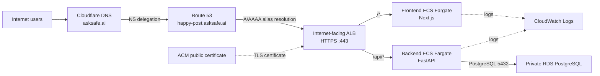

# Happy Post DevOps Candidate Technical Assessment

Happy Post is a DevOps assessment project with a Next.js frontend and FastAPI backend. The target delivery architecture uses two independently deployable container images and ECS Fargate services.

## Current status

The MVP application source is present: a FastAPI posts API and a Next.js post board. Neither service has been containerised or deployed. Terraform, CloudFormation changes, GitHub Actions workflows, and AWS resources are deliberately still outstanding.

- [Backend MVP](backend/README.md): posts API, operational endpoints, PostgreSQL-ready schema and migration, tests, linting, and local configuration example.
- [Frontend MVP](frontend/README.md): post board, backend API integration, operational endpoints, tests, linting, and local configuration example.

## Canonical baseline

- AWS environment and GitHub environment: `sandbox`
- Parent DNS: Cloudflare manages `asksafe.ai`
- Route 53 hosted zone: `happy-post.asksafe.ai`
- Application domain: `happy-post.asksafe.ai`
- Route 53 hosted-zone ID: `Z07821441TT04VLUXZXPO` (non-sensitive configuration)
- Delivery model: two images, two ECS services, one ECS cluster, and one HTTPS ALB
- Database: private Amazon RDS for PostgreSQL, accessed by the backend only
- Database recovery: automated backups and point-in-time recovery with seven-day retention
- RDS sandbox sizing: PostgreSQL 16.14, Single-AZ db.t4g.micro, encrypted gp3 storage (20–40 GiB)
- Terraform state: private versioned S3 state plus DynamoDB locking
- ECS scaling: CPU target tracking for each service (1–2 tasks, 65% target)
- Disabled optional services: WAF, Service Connect, blue/green deployment, VPC endpoints, notifications, and end-to-end TLS

## Planned public routes

| Route | Destination |
| --- | --- |
| `/*` | Frontend service |
| `/api/*` | Backend service |
| `/frontend/healthz`, `/frontend/version` | Frontend service |
| `/backend/healthz`, `/backend/version` | Backend service |

## High-level solution architecture

The diagram shows DNS delegation and high-level request routing. Cloudflare remains the parent DNS provider for `asksafe.ai` and delegates `happy-post.asksafe.ai` to the Route 53 hosted zone. Route 53 resolves the application domain to the internet-facing ALB; ACM terminates HTTPS at that ALB.

The maintainable logical source is [solution architecture](docs/diagrams/solution-architecture.mmd). The focused [runtime diagram](docs/diagrams/aws-ecs-runtime-architecture.drawio.svg) and [delivery/control-plane diagram](docs/diagrams/delivery-and-control-plane.drawio.svg) are explained in [Architecture](docs/architecture.md).

## Documentation

- [Architecture](docs/architecture.md)
- [Networking](docs/networking.md)
- [CI/CD and control plane](docs/cicd.md)
- [Assessment traceability](docs/assessment-traceability.md)
- [Implementation backlog](docs/implementation-backlog.md)
- [Security decisions](docs/security-decisions.md)
- [Deployment and rollback](docs/deployment-and-rollback.md)
- [Operations](docs/operations.md)
- [Git and pull-request conventions](docs/git-and-pr-conventions.md)
- [Diagram sources](docs/diagrams/)

## Before infrastructure bootstrap

Supply the final GitHub repository subject, the existing GitHub OIDC provider ARN, and the `sandbox` GitHub environment. The approved backend inputs are state bucket `happy-post-tfstate-893794041695-ap-southeast-2`, state prefix `sandbox/`, lock table `happy-post-sandbox-terraform-lock`, and hosted-zone ID `Z07821441TT04VLUXZXPO`. CloudFormation creates the bucket and lock table, so confirm the bucket name is globally available and has not been manually created. Sandbox has no required reviewers; future production approval gates are out of scope. Before Terraform apply, verify the selected PostgreSQL 16.x minor is available in `ap-southeast-2`. Do not place credentials, tokens, or other secret values in this repository.
