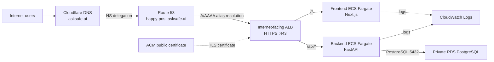

# Happy Post

Happy Post is a cloud-native application with a Next.js frontend and FastAPI backend. The delivery architecture uses two independently deployable container images and ECS Fargate services.

## Current status

The MVP application source is present: a FastAPI posts API and a Next.js post board. P3 local containerisation is complete: the two services run together through Docker Compose. P4's Terraform network foundation is applied. The private RDS data stack and its manual Terraform plan control are implemented and validated, but await a later approved workflow-dispatch apply. Terraform, application, and security test workflows are implemented; the remaining Terraform stacks, AWS workload resources, database integration, image publication, and deployment remain outstanding.

- [Backend MVP](backend/README.md): posts API, operational endpoints, PostgreSQL-ready schema and migration, tests, linting, and local configuration example.
- [Frontend MVP](frontend/README.md): post board, backend API integration, operational endpoints, tests, linting, and local configuration example.
- [Terraform foundation](infra/terraform/README.md): version constraints, remote state, applied sandbox network, and planned private data root.
- [Terraform workflow controls](.github/workflows/terraform-plan.yml): backend-free PR validation plus manual target-selected plan, apply, and destroy controls.
- [Application CI](.github/workflows/application-ci.yml): changed-component backend and frontend linting, unit tests, and frontend build checks.

## Run locally with containers

Docker Compose defines exactly two local services: `backend` and `frontend`. It does
not start PostgreSQL. From the repository root, run:

```bash
docker compose up --build -d
docker compose ps
docker compose down --remove-orphans
```

The frontend is available at `http://127.0.0.1:3000`; its relative `/api/posts`
request is forwarded internally to `http://backend:8000`. The backend is available
at `http://127.0.0.1:8000` by default. If port 8000 is temporarily in use, change
only the non-sensitive host-side binding:

```bash
HAPPY_POST_BACKEND_HOST_PORT=18000 docker compose up --build -d
HAPPY_POST_BACKEND_HOST_PORT=18000 docker compose ps
HAPPY_POST_BACKEND_HOST_PORT=18000 docker compose down --remove-orphans
```

This keeps the backend container and internal frontend routing on `backend:8000`.
Both host ports bind only to loopback. The images run as non-root users and contain
no secrets. This local P3 work does not change the planned AWS ECS, ALB, OIDC, or
RDS architecture.

## Canonical baseline

- AWS environment and GitHub environment: `sandbox`
- Parent DNS: Cloudflare manages `asksafe.ai`
- Route 53 hosted zone: `happy-post.asksafe.ai`
- Application domain: `happy-post.asksafe.ai`
- Route 53 hosted-zone ID: `Z07821441TT04VLUXZXPO` (non-sensitive configuration)
- Delivery model: two images, two ECS services, one ECS cluster, and one HTTPS ALB
- Database: private Amazon RDS for PostgreSQL, accessed by the backend only
- Database recovery: automated backups and point-in-time recovery with seven-day retention
- RDS sandbox sizing: PostgreSQL 16.14, Single-AZ db.t4g.micro, encrypted gp3 storage (20–40 GiB)
- Terraform state: private versioned S3 state plus deletion-protected DynamoDB locking
- ECS scaling: CPU target tracking for each service (1–2 tasks, 65% target)
- Disabled optional services: WAF, Service Connect, blue/green deployment, VPC endpoints, notifications, and end-to-end TLS

## Planned public routes

| Route | Destination |
| --- | --- |
| `/*` | Frontend service |
| `/api/*` | Backend service |
| `/frontend/healthz`, `/frontend/version` | Frontend service |
| `/backend/healthz`, `/backend/version` | Backend service |

## High-level solution architecture



The diagram shows DNS delegation and high-level request routing. Cloudflare remains the parent DNS provider for `asksafe.ai` and delegates `happy-post.asksafe.ai` to the Route 53 hosted zone. Route 53 resolves the application domain to the internet-facing ALB; ACM terminates HTTPS at that ALB.

The maintainable logical source is [solution architecture](docs/diagrams/solution-architecture.mmd). The focused [runtime diagram](docs/diagrams/aws-ecs-runtime-architecture.drawio.svg) and [delivery/control-plane diagram](docs/diagrams/delivery-and-control-plane.drawio.svg) are explained in [Architecture](docs/architecture.md).

## Documentation

- [Architecture](docs/architecture.md)
- [Networking](docs/networking.md)
- [CI/CD and control plane](docs/cicd.md)
- [Requirements traceability](docs/requirements-traceability.md)
- [Implementation backlog](docs/implementation-backlog.md)
- [Security decisions](docs/security-decisions.md)
- [Deployment and rollback](docs/deployment-and-rollback.md)
- [Operations](docs/operations.md)
- [Git and pull-request conventions](docs/git-and-pr-conventions.md)
- [Diagram sources](docs/diagrams/)

## Bootstrap status

CloudFormation bootstrap created the private state bucket `happy-post-tfstate-893794041695-ap-southeast-2` and lock table `happy-post-sandbox-terraform-lock`, using logical state prefix `sandbox/`. Its version-controlled source is [infra/bootstrap/happy-post-terraform-bootstrap.yaml](infra/bootstrap/happy-post-terraform-bootstrap.yaml). The state bucket is versioned and retained; the lock table is deletion-protected and retained on bootstrap stack delete or replacement. Sandbox has no required reviewers. A deliberate bootstrap teardown requires documented approval, safe removal of dependent Terraform state, disabling DynamoDB deletion protection, then explicit deletion of the retained lock table. Do not place credentials, tokens, or other secret values in this repository.
