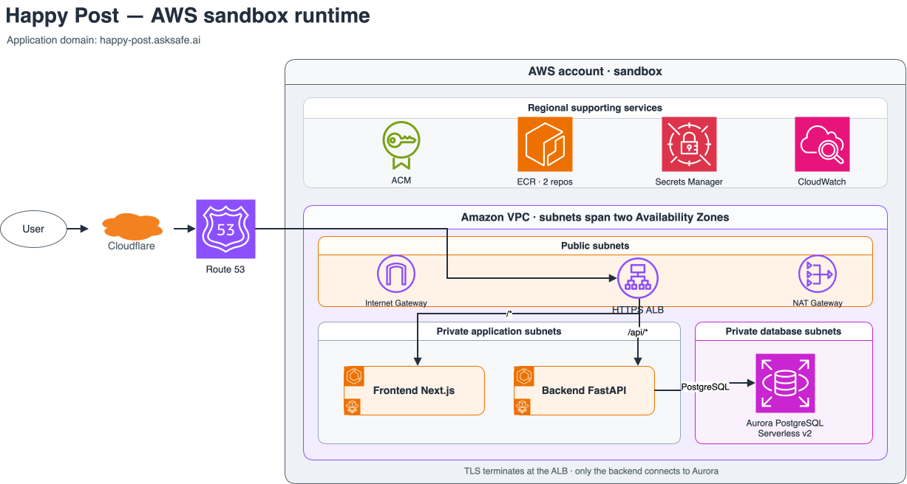
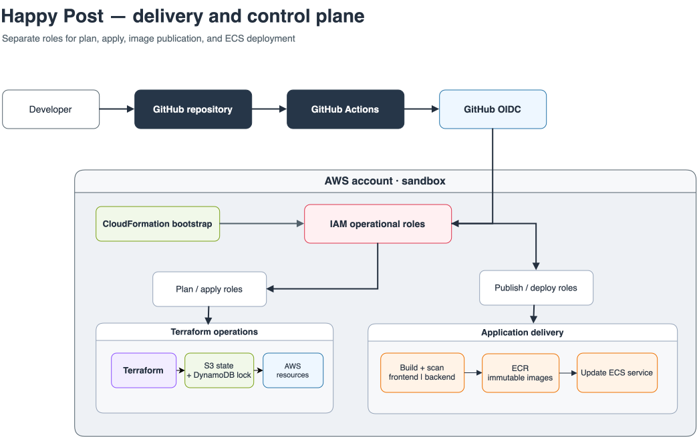

# Solution Architecture

Happy Post is a single-environment AWS sandbox with two independently deployable workloads: a Next.js frontend and a FastAPI backend.

## High-Level Solution Architecture

~~~mermaid
flowchart LR
    users[Internet users] --> cloudflare[Cloudflare DNS asksafe.ai]
    cloudflare -->|NS delegation| route53[Route 53 happy-post.asksafe.ai]
    route53 -->|A/AAAA alias resolution| alb[Internet-facing ALB HTTPS :443]
    acm[ACM public certificate] -. "TLS certificate" .-> alb
    alb -->|/*| frontend[Frontend ECS Fargate Next.js]
    alb -->|/api/*| backend[Backend ECS Fargate FastAPI]
    backend -->|PostgreSQL 5432| rds[Private RDS PostgreSQL]
    frontend -. logs .-> logs[CloudWatch Logs]
    backend -. logs .-> logs
~~~

Cloudflare remains the parent DNS provider for asksafe.ai and delegates happy-post.asksafe.ai to Route 53. Route 53 resolves the application domain to the public ALB; ACM terminates HTTPS at the ALB.

## AWS Sandbox Network and Runtime

The frontend and backend are deployed as independently versioned ECS Fargate services behind a shared HTTPS Application Load Balancer. Path-based routing sends `/*` traffic to the Next.js frontend and `/api/*` traffic to the FastAPI backend. Only the backend security group can connect to Amazon RDS PostgreSQL on TCP 5432. Database credentials are retrieved through ECS task-definition secret injection by the backend task execution role. Both services use separate ECR repositories, task-definition families, target groups, log groups, and deployment histories while sharing the ECS cluster, VPC, ALB, and application domain.

The runtime diagram deliberately separates deployed traffic and network controls from provisioning and CI/CD. Amazon ECR, Secrets Manager, CloudWatch, Route 53, and ACM are regional managed services outside the VPC. RDS is private in database subnets; Secrets Manager is not placed in a database subnet.

## Delivery and Control Plane

CloudFormation bootstrap creates the private versioned S3 Terraform state bucket, DynamoDB lock table, runtime permissions boundary, and distinct GitHub Actions roles while reusing the existing account-level GitHub OIDC provider. GitHub Actions uses separate Terraform plan, Terraform apply, ECR publish, and ECS deployment roles. Frontend and backend images are built, scanned, published, deployed, and rolled back independently.

## DNS and TLS Boundary

| Configuration | Value |
| --- | --- |
| Route 53 hosted zone | happy-post.asksafe.ai |
| Hosted-zone ID | Z07821441TT04VLUXZXPO |
| Application domain | happy-post.asksafe.ai |

The hosted-zone ID is non-sensitive configuration. Terraform manages ACM DNS-validation and application records only inside the delegated Route 53 zone; it never manages Cloudflare parent-zone delegation. TLS terminates at the ALB. ALB-to-task traffic is HTTP; end-to-end TLS is deferred. API Gateway and CloudFront are not baseline components.

## Network Egress

Sandbox uses one NAT Gateway in a public subnet as an explicit cost/availability trade-off. Private application subnets use it for outbound ECR, CloudWatch Logs, and approved external-dependency access. The Internet Gateway supports the public ALB and NAT Gateway only. RDS has no public route. VPC endpoints remain disabled.

## Routing

| ALB path | Target |
| --- | --- |
| /* | Frontend ECS service |
| /api/* | Backend ECS service |
| /frontend/healthz, /frontend/version | Frontend ECS service |
| /backend/healthz, /backend/version | Backend ECS service |

Each service must expose container-local `/healthz` and `/version`, plus its public component aliases listed above. ALB does not rewrite request paths. Listener priority is: `/api/*`, backend validation aliases, frontend validation aliases, then `/*` as the default frontend rule.

## ECS Service Scaling

Each ECS service uses CPU target-tracking scaling: minimum one task, maximum two tasks, and a 65% CPU target. This is intentionally modest for sandbox cost control. Fargate supplies compute capacity, so no ECS cluster auto-scaling configuration is required.

## CI/CD Delivery Architecture

~~~mermaid
flowchart TB
    pr[Pull request] --> checks[Tests, linting, Snyk, SonarQube, Trivy, Terraform format, validate, and TFLint]
    checks --> merge[Protected merge to main]
    merge --> scope{Changed scope}
    scope -->|Application| build[Build, scan, and push changed immutable image digest]
    build --> sandbox[GitHub environment: sandbox OIDC and configuration boundary]
    sandbox --> deploy[Deploy selected ECS service]
    deploy --> verify[ECS stability and component smoke test]
    verify --> result{Successful?}
    result -->|Yes| complete[Deployment complete]
    result -->|No| rollback[Rollback affected ECS service]
    manual_plan[Manual Terraform plan select target] --> fresh_plan[Workflow dispatch resolves immutable main commit]
    fresh_plan --> tf_sandbox[GitHub environment: sandbox]
    tf_sandbox --> apply[Apply that exact plan]
~~~

The sandbox environment is an OIDC/configuration boundary, not an approval gate: it has no required reviewers. Pull requests run backend-free Terraform validation only and never receive AWS credentials. Terraform plan, apply, and destroy are workflow-dispatch-only operations: each resolves and logs the immutable `main` SHA and accepts only a fixed canonical-root target. Plan uses the read-only plan role; apply creates a fresh plan for that checkout and applies that exact plan through the separate apply role. Merge never applies Terraform. Detailed sources are [CI/CD diagram](diagrams/cicd.mmd) and [Terraform diagram](diagrams/terraform.mmd).

## Terraform and Deployment Ownership

Terraform owns foundations and stable configuration: networking, private RDS PostgreSQL and database subnets/security group, Secrets Manager database credentials, ALB/listeners, Route 53 and ACM records, ECR, ECS cluster/services, IAM, logging, and initial task definitions. The mandatory data stack has its own state and lifecycle.

CloudFormation bootstrap owns the S3 state bucket, DynamoDB lock table, runtime permissions boundary, and GitHub OIDC roles. Terraform uses the S3 backend with DynamoDB as the only locking mechanism. The version-controlled bootstrap source is [`infra/bootstrap/happy-post-terraform-bootstrap.yaml`](../infra/bootstrap/happy-post-terraform-bootstrap.yaml). The state bucket is retained; the lock table has deletion protection and is retained on bootstrap stack deletion or replacement.

The version-controlled [`foundations/network`](../infra/terraform/foundations/network) root declares the applied two-AZ VPC, public/application/database subnet tiers, one NAT Gateway, route tables, and ALB/frontend/backend/database security-group boundaries. The separate [`stacks/data`](../infra/terraform/stacks/data) root reads only its network outputs and has its own `sandbox/stacks/data/terraform.tfstate` object. It creates the private DB subnet group, fixed-name database credentials secret, and RDS instance when a future approved data-target apply is dispatched.

## Bootstrap Inputs

| Input | Approved value |
| --- | --- |
| State bucket name | `happy-post-tfstate-893794041695-ap-southeast-2` |
| State-key prefix | `sandbox/` |
| DynamoDB lock table | `happy-post-sandbox-terraform-lock` |
| Route 53 hosted-zone ID | `Z07821441TT04VLUXZXPO` |

CloudFormation created the state bucket and lock table. The lock table must not be removed during normal bootstrap teardown: first remove dependent Terraform state safely, disable DynamoDB deletion protection through an approved operation, then explicitly remove the retained table only if teardown is required.

An ECR push does not update ECS by itself. CI verifies the pushed immutable digest, registers a later digest-pinned task-definition revision, and updates the selected ECS service to that revision. Terraform ignores subsequent service task-definition drift so that it does not undo a valid deployment.

## RDS Sandbox Configuration

| Setting | Value |
| --- | --- |
| Engine | PostgreSQL 16.14 initially; automatic minor upgrades; verify available PostgreSQL 16.x in ap-southeast-2 before apply |
| Instance | Single-AZ db.t4g.micro |
| Storage | Encrypted gp3, 20 GiB allocated, 40 GiB maximum autoscaled |
| Recovery | Seven-day PITR; backup 15:30-16:00 UTC daily |
| Maintenance | sun:16:30-sun:17:00 UTC |
| Credentials | Generated by Terraform and stored only in `happy-post-sandbox-database-credentials`; secret value is never an output |
| Destroy | Deletion protection disabled; final snapshot required with a stable random suffix; automated backups not retained |

See [Operations](operations.md) for the required restore-test procedure.

## Explicitly Outside the Baseline

WAF, ECS Service Connect, ECS blue/green deployment, VPC endpoints, deployment notifications, customer-managed KMS, and end-to-end TLS are disabled by default. Each needs separate approval and documentation before adoption.
